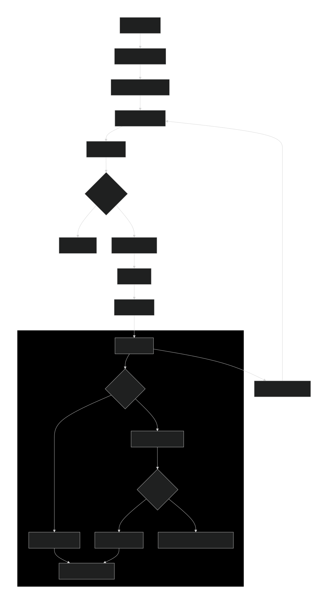

## 🧭 RESUMEN GENERAL DEL CORE

### Arquitectura

El core de tu minishell se divide en cuatro pilares:

1. **Inicialización (`init_data`, `global.c`):**

   * Se crea la estructura principal `t_data`.
   * Se copia el entorno (`envp`) en una lista enlazada `t_env`.
   * Se inicializa la variable global `g_sigint_status` a 0.

2. **Gestión de señales (`sigint_handler`, `sigquit_handler`, `setup_signals`):**

   * Usa `sigaction` con `SA_RESTART` para evitar que `readline()` falle.
   * `SIGINT` imprime una línea nueva y actualiza el prompt.
   * `SIGQUIT` se ignora o se almacena sin hacer ruido.
   * Solo una variable global para comunicación segura entre handler y shell.

3. **Bucle REPL (`main` y `rep_loop`):**

   * Distingue entre modo interactivo (`readline`) y no interactivo (`get_next_line`).
   * Lee, tokeniza, parsea, expande variables y ejecuta comandos.
   * Si ocurre error de parsing o señal, limpia y continúa sin colapsar.
   * Soporta `Ctrl-C`, `Ctrl-D` y `Ctrl-\` como bash.

4. **Gestión de memoria (`ft_cleanup_loop`, `ft_cleanup_end`, `ft_free_array`):**

   * Limpieza entre iteraciones y limpieza final.
   * Libera tokens, parser, entorno, y estructuras principales.
   * Cierra correctamente readline con `rl_clear_history()`.

---

## 🧠 PREGUNTAS FRECUENTES

**1. ¿Por qué usas una variable global?**

> Porque el subject lo permite solo para comunicar señales.
> Usamos `volatile sig_atomic_t g_sigint_status` ya que es el único tipo seguro para escritura desde un handler de señal.
> No contiene datos del shell, solo el número de señal recibido.

---

**2. ¿Qué diferencia hay entre `signal()` y `sigaction()`?**

> `sigaction()` es más predecible y permite flags como `SA_RESTART`.
> Garantiza que el handler no se desactive automáticamente y evita interrupciones en funciones bloqueantes como `readline()`.

---

**3. ¿Qué pasa al presionar `Ctrl-C`, `Ctrl-D` o `Ctrl-\`?**

> * `Ctrl-C` → el handler imprime una nueva línea y reinicia el prompt (`status = 130`).
> * `Ctrl-D` → `readline` devuelve `NULL`; el bucle imprime `exit` y termina el shell.
> * `Ctrl-\` → se ignora (o setea `status = 131` si ocurre en proceso hijo).

---

**4. ¿Cómo se maneja la memoria?**

> Cada iteración libera los tokens, parser y la línea de entrada.
> Al final, también se libera el entorno y la estructura principal.
> No hay leaks porque cada malloc tiene su free correspondiente.

---

**5. ¿Por qué diferenciar `ft_cleanup_loop` y `ft_cleanup_end`?**

> El primero limpia solo lo temporal del ciclo de lectura (tokens, parser, input).
> El segundo libera todo, incluido `env` y `data`.
> Mantenerlos separados evita liberar estructuras aún necesarias durante el bucle.

---

**6. ¿Cómo detectas si el shell es interactivo?**

> Con `isatty(STDIN_FILENO)`. Si devuelve true, usamos `readline` y mostramos prompt.
> Si es false, leemos con `get_next_line` para poder ejecutar desde un pipe o script.

---

**7. ¿Cómo te aseguras de que no haya fugas de memoria?**

> Uso sistemático de funciones `free_*` para cada estructura.
> Comprobado con `valgrind --leak-check=full` al terminar cada comando y al salir del shell.

---

**8. ¿Por qué devuelves `exit_signal` en `main()`?**

> Porque así `$?` refleja correctamente el estado del último comando.
> Permite además usar el minishell dentro de otros procesos o scripts con su código de salida real.

---

## 🔄 DIAGRAMA DE FLUJO (texto)

```
        ┌────────────────────────────┐
        │         main()             │
        └───────┬────────────────────┘
                │
                ▼
        ┌────────────────────────────┐
        │ init_data(envp)            │
        │ setup_signals()            │
        │ isatty(STDIN_FILENO)?      │
        └──────────┬─────────────────┘
                   │
                   ▼
        ┌────────────────────────────┐
        │   REPL LOOP (rep_loop)     │
        └──────────┬─────────────────┘
                   │
                   ▼
        ┌────────────────────────────┐
        │ read_input()               │
        │  - readline() o gnl()      │
        └──────────┬─────────────────┘
                   │
             input == NULL?
             │          │
             │          ▼
             │     print "exit"
             │          │
             │     break loop
             ▼
        ┌────────────────────────────┐
        │ tokenizer(input)           │
        │ parse_command(tokens)      │
        └──────────┬─────────────────┘
                   │
           parsing error?
                   │
                   ▼
             cleanup_loop()
                   │
                   ▼
        ┌────────────────────────────┐
        │ expander(cmd_list, env)    │
        │ execute_all(data)          │
        │ sigint_check()             │
        └──────────┬─────────────────┘
                   │
                   ▼
             cleanup_loop()
                   │
                   ▼
          (loop repeats until EOF)
                   │
                   ▼
        ┌────────────────────────────┐
        │   cleanup_end(data)        │
        └────────────────────────────┘
```

---



